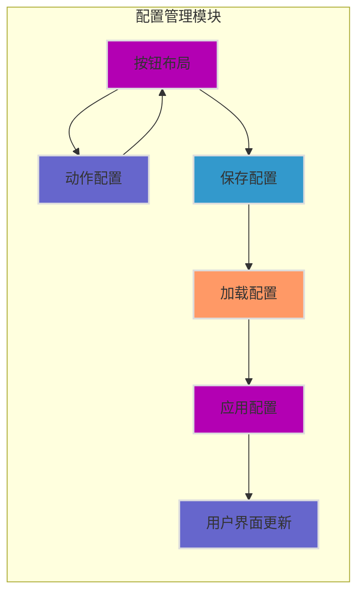
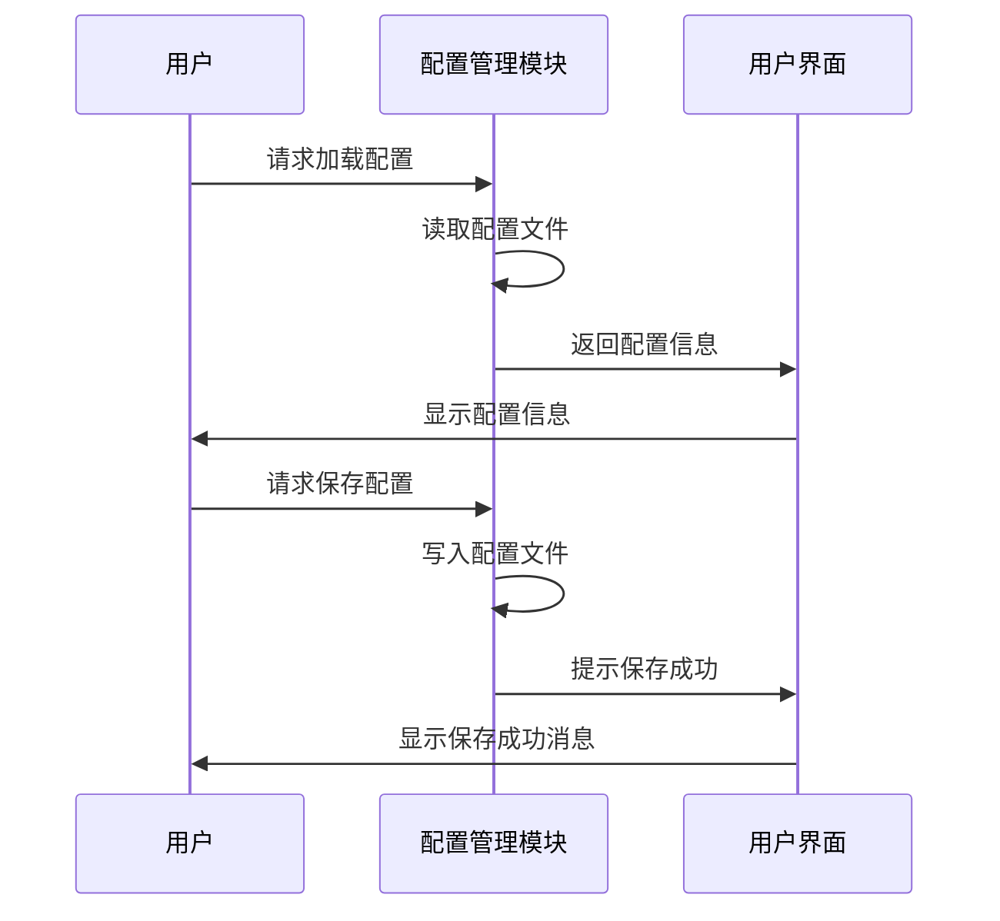
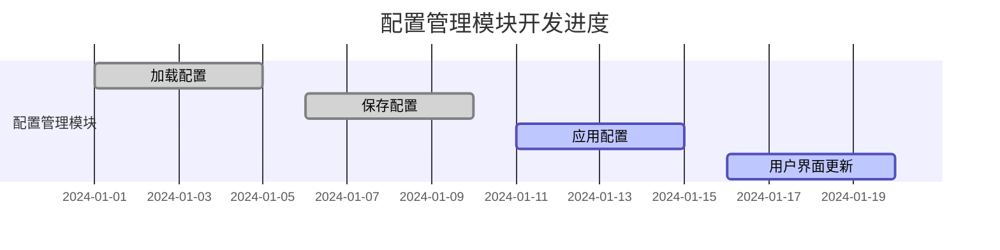
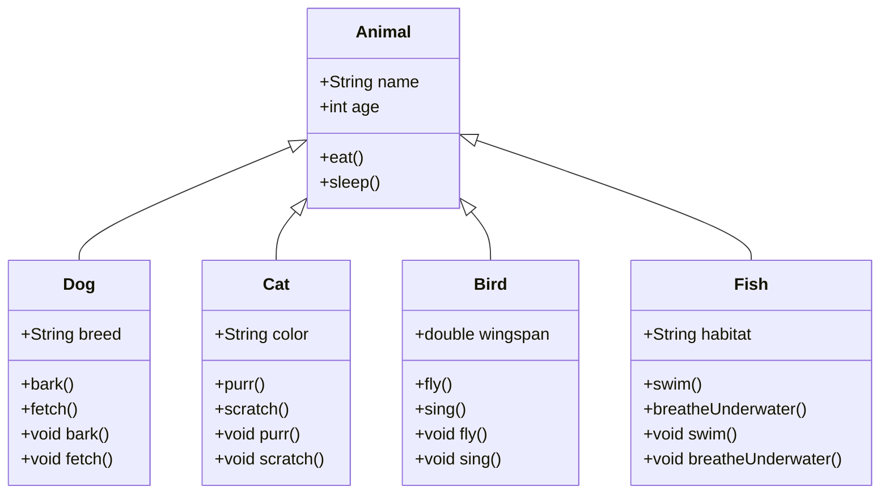
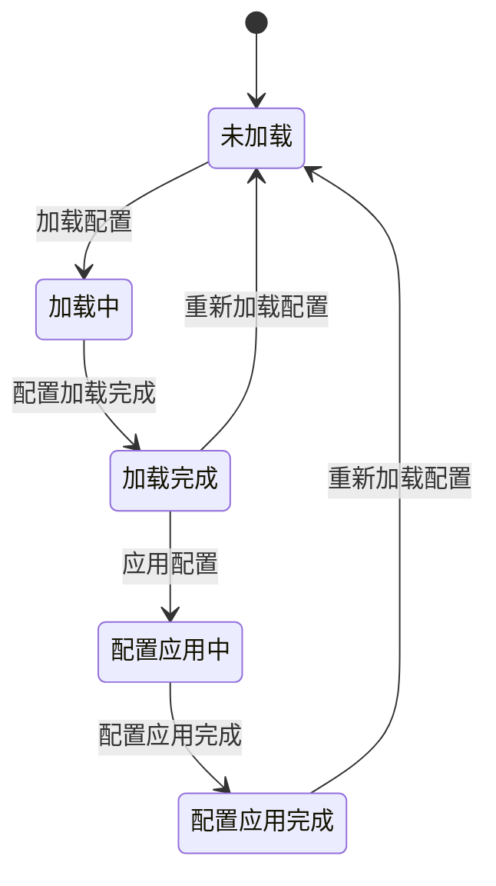
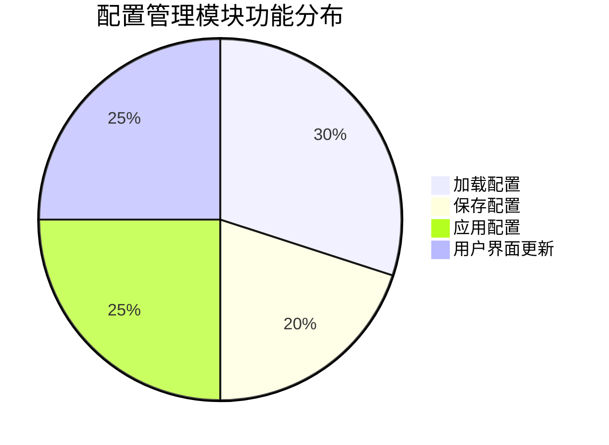
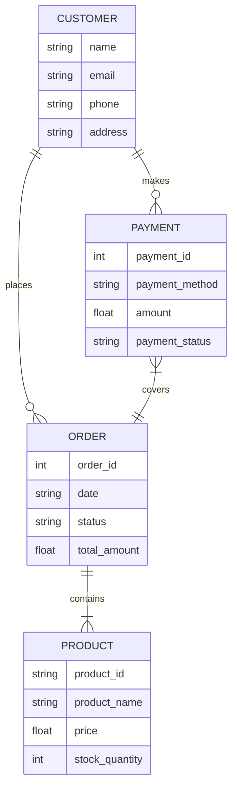
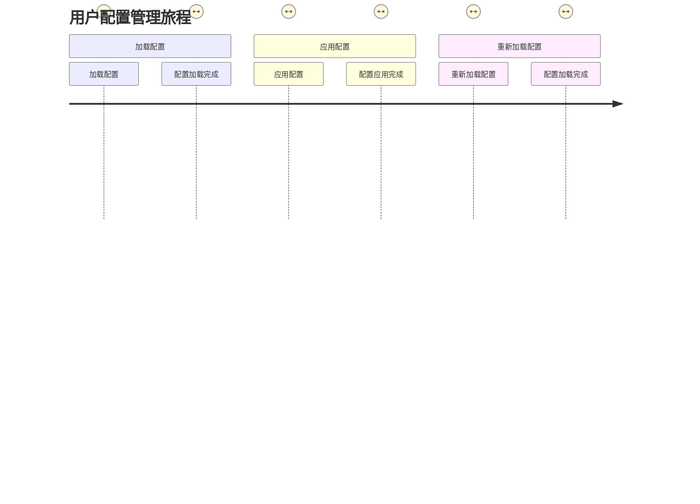

# mermaid演示：
## 1.流程图

```mermaid "
%% 流程图 (Flowchart)
flowchart LR
    subgraph 配置管理模块
        direction TB
        A[按钮布局] --> B[动作配置]
        B --> A
        A --> C[保存配置]
        C --> D[加载配置]
        D --> E[应用配置]
        E --> F[用户界面更新]
    end

%% 使用合适颜色适配 dark 模式
    style A fill:#b300b3,stroke:#ddd,stroke-width:2px
    style B fill:#6666cc,stroke:#ddd,stroke-width:2px
    style C fill:#3399cc,stroke:#ddd,stroke-width:2px
    style D fill:#ff9966,stroke:#ddd,stroke-width:2px
    style E fill:#b300b3,stroke:#ddd,stroke-width:2px
    style F fill:#6666cc,stroke:#ddd,stroke-width:2px
```
## 2.时序图

```mermaid"
%% 时序图 (Sequence Diagram)
sequenceDiagram
    participant 用户
    participant 配置管理模块
    participant 用户界面

    用户 ->> 配置管理模块: 请求加载配置
    配置管理模块 ->> 配置管理模块: 读取配置文件
    配置管理模块 ->> 用户界面: 返回配置信息
    用户界面 ->> 用户: 显示配置信息

    用户 ->> 配置管理模块: 请求保存配置
    配置管理模块 ->> 配置管理模块: 写入配置文件
    配置管理模块 ->> 用户界面: 提示保存成功
    用户界面 ->> 用户: 显示保存成功消息
```

## 3.甘特图

```mermaid
%% 甘特图 (Gantt Chart)
gantt
    dateFormat  YYYY-MM-DD
    title 配置管理模块开发进度
    section 配置管理模块
    加载配置           :done,    des1, 2024-01-01,2024-01-05
    保存配置           :done,    des2, 2024-01-06,2024-01-10
    应用配置           :active,  des3, 2024-01-11,2024-01-15
    用户界面更新       :active,  des4, 2024-01-16,2024-01-20

```

## 4.类图

```mermaid"
%% 类图 (Class Diagram)
classDiagram
  class Animal {
    +String name
    +int age
    +eat()
    +sleep()
  }

  class Dog {
    +String breed
    +bark()
    +fetch()
  }

  class Cat {
    +String color
    +purr()
    +scratch()
  }

  class Bird {
    +double wingspan
    +fly()
    +sing()
  }

  class Fish {
    +String habitat
    +swim()
    +breatheUnderwater()
  }

  Animal <|-- Dog
  Animal <|-- Cat
  Animal <|-- Bird
  Animal <|-- Fish

  Dog : +void bark()
  Dog : +void fetch()

  Cat : +void purr()
  Cat : +void scratch()

  Bird : +void fly()
  Bird : +void sing()

  Fish : +void swim()
  Fish : +void breatheUnderwater()

```

## 5.状态图

```mermaid"
%% 状态图 (State Diagram)
stateDiagram-v2
    [*] --> 未加载
    未加载 --> 加载中: 加载配置
    加载中 --> 加载完成: 配置加载完成
    加载完成 --> 未加载: 重新加载配置
    加载完成 --> 配置应用中: 应用配置
    配置应用中 --> 配置应用完成: 配置应用完成
    配置应用完成 --> 未加载: 重新加载配置

```

## 6.饼图

```mermaid"
%% 饼图 (Pie Chart)
pie
    title 配置管理模块功能分布
    "加载配置" : 30
    "保存配置" : 20
    "应用配置" : 25
    "用户界面更新" : 25
```

## 7.关系图

```mermaid"
%% 关系图 (Relationship Diagram)
%% 关系图 (Relationship Diagram)
erDiagram
  CUSTOMER {
    string name
    string email
    string phone
    string address
  }

  ORDER {
    int order_id
    string date
    string status
    float total_amount
  }

  PRODUCT {
    string product_id
    string product_name
    float price
    int stock_quantity
  }

  PAYMENT {
    int payment_id
    string payment_method
    float amount
    string payment_status
  }

  CUSTOMER ||--o{ ORDER : places
  ORDER ||--|{ PRODUCT : contains
  CUSTOMER ||--o{ PAYMENT : makes
  PAYMENT }|--|| ORDER : covers


```

## 8.用户旅程图

```mermaid"
%% 用户旅程图 (User Journey Diagram)
journey
    title 用户配置管理旅程
    section 加载配置
        加载配置: 用户请求加载配置
        配置加载完成: 配置加载完成
    section 应用配置
        应用配置: 用户请求应用配置
        配置应用完成: 配置应用完成
    section 重新加载配置
        重新加载配置: 用户请求重新加载配置
        配置加载完成: 配置加载完成

```
