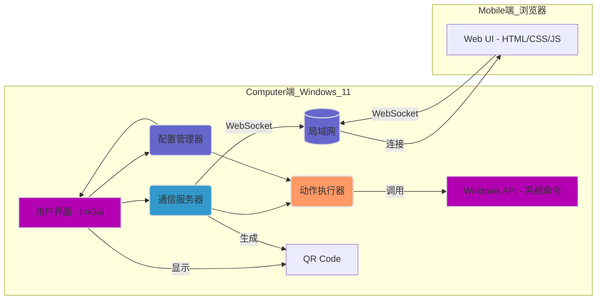

# 项目名称：WebStreamDeck (示例名) - C++桌面端与Web手机端联动控制系统

**版本:** 1.0
**日期:** 2024-07-25
**目标平台:** Windows 11 (开发环境: Visual Studio 2022)
**核心技术:** C++, ImGui, WebSocket, WinAPI, JSON (所有 C++ 依赖项通过 vcpkg 管理)
**推荐依赖库 (vcpkg):** `imgui[core,glfw-binding,opengl3-binding]`, `websocketpp` (或 `uwebsockets`), `nlohmann-json`, `qrcodegen`

## 1. 概述 (Overview)

本项目旨在创建一个桌面应用程序，允许用户配置自定义操作按钮（类似 Stream Deck），并通过手机浏览器扫描二维码连接后，在手机网页上触发这些按钮，从而在电脑上执行相应操作。系统采用 C++ 作为主要开发语言，利用 ImGui 库构建用户界面，结合独立的网络库进行 WebSocket 通信，并结合 Windows API 实现底层系统操作。


## 2. 系统架构图 (Conceptual Architecture)



**图例:**

*   **用户界面 (ImGui):** 桌面程序的即时模式图形用户界面，用于配置按钮、显示状态和二维码。
*   **配置管理器:** 负责加载、保存和管理按钮布局及对应操作的配置信息（例如存为 JSON 文件）。
*   **通信服务器:** 内嵌 WebSocket 服务器 (使用独立 C++ 库实现)，处理来自手机端 Web UI 的连接请求和命令消息，并将命令转发给动作执行器。同时负责生成本机 IP 和端口信息用于二维码。
*   **动作执行器:** 接收来自通信服务器的指令，解析并执行对应的本地操作（如启动程序、模拟按键等）。
*   **Windows API / 系统命令:** 动作执行器调用的底层接口，实现具体功能。
*   **QR Code:** 显示包含服务器地址（IP:端口）的二维码，供手机扫描。
*   **Web UI (手机端):** 运行在手机浏览器中的前端界面，显示按钮并发送点击事件到通信服务器。
*   **局域网:** 连接电脑和手机的网络环境。

## 3. 核心组件详述 (Core Components)

### 3.1. 桌面端应用程序 (Backend/Server - C++)

#### 3.1.1. 主应用程序 (`WebStreamDeckApp`)
*   **框架:** ImGui (需要结合后端，如 GLFW, SDL 或直接使用 Win32)。
*   **职责:**
    *   初始化应用程序环境 (包括窗口、图形上下文、ImGui 上下文)。
    *   创建并管理配置管理器、通信服务器和动作执行器实例。
    *   运行主事件循环，处理用户输入和渲染 ImGui 界面。
    *   处理应用程序生命周期事件。

#### 3.1.2. 配置管理模块 (`ConfigManager`)
*   **实现:** C++ 类。
*   **职责:**
    *   定义按钮布局和动作的数据结构 (例如，使用 `struct` 或类)。
    *   提供加载配置文件的接口 (如 `loadConfig(filePath)`)。
    *   提供保存配置文件的接口 (如 `saveConfig(filePath)`)。
    *   提供获取当前配置数据的接口 (供 UI 和动作执行器使用)。
    *   **存储格式:** JSON (使用独立的 C++ JSON 库，如 nlohmann/json 进行解析和生成)。配置文件可存储按钮 ID、名称、图标路径/数据、动作类型、动作参数等。

#### 3.1.3. 用户界面模块 (`UIManager`)
*   **框架:** ImGui。
*   **职责:**
    *   **按钮配置界面:**
        *   在 ImGui 窗口中 (`ImGui::Begin`/`End`) 绘制按钮网格。
        *   使用 ImGui 控件 (按钮、文本框等) 允许用户添加、删除、编辑按钮。
        *   为每个按钮设置：名称、图标 (可选，加载图片文件，使用 `ImGui::Image` 显示)、动作类型 (启动程序、快捷键、脚本、URL等)、动作参数 (程序路径、键序列、脚本路径、网址等)。
        *   调用 `ConfigManager` 保存更改。
    *   **主界面窗口:**
        *   使用 `ImGui::Text` 等显示当前状态 (服务器是否运行、连接的客户端数量等)。
        *   显示二维码 (使用 QR Code 生成库生成图片数据，加载为纹理并通过 `ImGui::Image` 显示)。
        *   提供启动/停止服务器的控件 (`ImGui::Button`)。
        *   使用 ImGui 的文本控件或日志窗口显示日志信息 (可选)。

#### 3.1.4. 通信服务模块 (`CommServer`)
*   **框架:** 独立的 C++ WebSocket 库 (如 Boost.Asio, uWebSockets, cpp-websocket)。
*   **实现:** C++ 类。
*   **职责:**
    *   初始化 WebSocket 服务器并监听指定端口。
    *   处理新的 WebSocket 连接请求。
    *   管理已连接的客户端 (根据所选库的数据结构)。
    *   处理客户端断开连接事件。
    *   接收来自客户端的消息 (通过库提供的回调或事件处理)。
    *   **消息协议:** 定义简单的 JSON 格式消息 (同前)。
    *   解析收到的 `button_press` 消息，提取 `button_id` (使用 JSON 库)。
    *   将有效的 `button_id` 通过回调、函数指针或直接调用传递给 `ActionExecutor`。
    *   获取本机局域网 IP 地址 (使用平台 API 或相关库)。
    *   生成包含 `ws://[IP]:[Port]` 信息的字符串，供 UI 生成二维码。

#### 3.1.5. 动作执行模块 (`ActionExecutor`)
*   **实现:** C++ 类。
*   **职责:**
    *   提供一个公共接口 (例如 `executeAction(buttonId)`) 被 `CommServer` 调用。
    *   根据 `buttonId` 从 `ConfigManager` 获取对应的动作配置。
    *   根据动作类型执行操作：
        *   **启动程序:** 使用标准库 (`std::system`) 或 Windows API `CreateProcess()` / `ShellExecute()`.
        *   **模拟按键/热键:** 使用 Windows API `SendInput()`. 需要仔细处理按键代码和组合键。
        *   **运行脚本:** 使用 `std::system` 或 `CreateProcess` 执行 `cmd.exe /c script.bat` 或 `powershell.exe -File script.ps1`。
        *   **打开 URL:** 使用 `ShellExecute()` (Windows)。
        *   **系统命令:** (如音量控制) 调用相应的 Windows API (如 Core Audio APIs)。
    *   处理执行过程中的错误，并提供反馈 (例如通过日志)。

### 3.2. 手机端 Web 界面 (Frontend - HTML/CSS/JS)

*   **技术:** HTML5, CSS3, JavaScript (ES6+). 可选用轻量级框架/库如 Vue.js, React, Preact 或原生 JS。
*   **职责:**
    *   **连接:** 页面加载后，使用 JavaScript 的 `WebSocket` API 连接到桌面端 `CommServer` 提供的 `ws://[IP]:[Port]` 地址 (地址通过扫描二维码获取或手动输入)。
    *   **界面渲染:**
        *   建立连接后，可以向服务器请求按钮配置 (如果服务器实现了该功能)，或者配置是固定的/嵌入在 HTML 中的。
        *   根据配置动态生成按钮网格。显示按钮名称或图标。
    *   **交互:**
        *   为每个按钮绑定触摸/点击事件监听器。
        *   当按钮被点击时，获取其对应的 `button_id`。
        *   通过 WebSocket 发送 JSON 消息 `{ "type": "button_press", "payload": { "button_id": "..." } }` 给服务器。
    *   **状态显示:** 显示连接状态 (连接中、已连接、已断开)。处理重连逻辑。
*   **部署:** 这些 HTML/CSS/JS 文件可以由桌面端的 `CommServer` 静态托管 (简单场景下可以硬编码在一个 C++ 字符串里，或者使用 Qt 资源系统 `.qrc` 编译进去，通过简单的 HTTP 响应发送)，或者由 `CommServer` 告知用户文件路径让用户自行在手机浏览器打开 (如果文件放在共享目录)。最方便的方式是 C++ 程序内嵌一个最简单的 HTTP 服务器来提供这些文件。

### 3.3. 通信协议 (WebSocket API)

*   **格式:** JSON
*   **主要消息:**
    *   **客户端 -> 服务器:**
        ```json
        {
          "type": "button_press",
          "payload": {
            "button_id": "string" // 按下按钮的唯一标识符
          }
        }
        ```
    *   **服务器 -> 客户端 (可选):**
        ```json
        {
          "type": "config_update", // 或 "initial_config"
          "payload": {
            "layout": [ // 按钮布局数组
              { "id": "btn1", "name": "记事本", "icon": "notepad.png" },
              { "id": "btn2", "name": "音量+", "icon": "vol_up.svg" }
              // ... 其他按钮
            ]
          }
        }
        ```
        ```json
        {
          "type": "status",
          "payload": {
            "message": "Connected", // 或 "Error: Action failed"
            "connected_clients": 1
          }
        }
        ```

## 4. 技术选型总结 (Technology Stack Summary)

*   **语言:** C++ (推荐 C++17 或更高版本)
*   **核心框架:** ImGui
*   **网络通信:** 独立 C++ WebSocket 库 (e.g., `websocketpp`, `uwebsockets`)
*   **系统交互:** Windows API (Win32)
*   **配置文件格式:** JSON (e.g., `nlohmann-json`)
*   **QR Code 生成:** `qrcodegen` C++ library
*   **依赖管理:** vcpkg
*   **构建系统:** CMake (与 vcpkg 集成)
*   **IDE:** Visual Studio 2022

## 5. 数据流示例 (Data Flow Examples)

### 5.1. 启动与连接
1.  用户启动桌面 C++ 程序。
2.  `ConfigManager` 加载 `config.json`。
3.  `MainWindow` 显示 UI，从 `ConfigManager` 获取配置在界面展示。
4.  `CommServer` 启动 WebSocket 服务器，监听端口，获取本机 IP。
5.  `MainWindow` 获取 IP 和端口，生成二维码并显示。
6.  用户在手机浏览器扫描二维码，获取 `ws://IP:Port`。
7.  手机 JS 尝试建立 WebSocket 连接。
8.  `CommServer` 接受连接，记录客户端。
9.  (可选) `CommServer` 发送初始配置给手机端。
10. 手机端收到配置，渲染按钮界面。

### 5.2. 触发动作
1.  用户在手机 Web UI 上点击一个按钮 (例如 "启动记事本")。
2.  手机 JS 获取按钮 ID ("notepad_button")。
3.  手机 JS 通过 WebSocket 发送: `{ "type": "button_press", "payload": { "button_id": "notepad_button" } }`。
4.  `CommServer` 接收消息，解析出 `button_id`。
5.  `CommServer` 调用 `ActionExecutor::executeAction("notepad_button")`。
6.  `ActionExecutor` 从 `ConfigManager` 查询 "notepad_button" 对应的动作 (类型: "launch_app", 参数: "notepad.exe")。
7.  `ActionExecutor` 调用 `CreateProcess("notepad.exe", ...)` 或 `ShellExecute(...)`。
8.  Windows 启动记事本程序。
9.  (可选) `ActionExecutor` 通过回调或状态变量告知 `CommServer` 执行成功/失败，`CommServer` 可将状态发回手机端。

## 6. 关键实现要点 (Key Implementation Points)

*   **WebSocket 协议的健壮性:** 需要处理 JSON 解析错误、无效消息类型、未知按钮 ID 等情况。
*   **动作执行的安全性与稳定性:**
    *   避免执行任意命令，只执行预配置的操作。
    *   使用 `SendInput` 时需要正确处理焦点和权限问题。
    *   对外部程序路径、脚本路径进行验证。
    *   提供错误处理和日志记录。
*   **配置文件结构设计:** 既要灵活支持不同类型的动作，又要易于解析和编辑 (使用选定的 JSON 库)。
*   **QR Code 生成与显示:** 集成 QR Code 库，生成图像数据，加载为纹理并在 ImGui 中使用 `ImGui::Image` 显示。
*   **网络发现:** 正确获取本机在局域网中的 IP 地址，需要处理多网卡的情况（通常选择连接到默认网关的那个）。告知用户手机和电脑需在同一局域网。
*   **错误处理与日志:** 在网络通信、文件读写、动作执行等关键环节添加详细的错误处理和日志输出，便于调试。
*   **线程:** 网络服务器和可能的长时间动作执行应在不同的线程中运行，以避免阻塞 ImGui 的渲染循环。需要使用标准 C++ 线程 (`std::thread`) 或异步操作进行管理。

## 7. 潜在挑战与考虑 (Potential Challenges & Considerations)

*   **UI 开发:** 使用 ImGui 创建复杂的布局和自定义样式可能与传统 GUI 框架不同，需要适应其即时模式的理念。
*   **Windows API 复杂性:** 精确模拟按键、控制特定应用可能需要深入了解相关的 Windows API 和潜在的权限问题。
*   **网络库集成:** 选择和集成合适的 WebSocket 库需要一些工作。
*   **网络配置:** 用户端的防火墙可能会阻止连接，需要给出提示。
*   **安全性:** 虽然主要在局域网内，但应避免配置可执行任意代码或访问敏感文件的动作。通信未加密 (WebSocket `ws://`)。如果需要加密，需使用 `wss://` 并处理证书。
*   **跨平台:** ImGui 本身是跨平台的，但 `ActionExecutor` 中大量使用 Windows API 会限制其直接在 macOS/Linux 上运行，需要为其他平台编写特定的动作执行代码。后端库 (GLFW/SDL) 通常是跨平台的。

## 8. 部署 (Deployment)

*   **依赖管理 (vcpkg):**
    *   确保已安装 [vcpkg](https://github.com/microsoft/vcpkg)。
    *   使用 vcpkg 安装项目所需的依赖项。例如:
        ```bash
        vcpkg install imgui[core,glfw-binding,opengl3-binding] websocketpp nlohmann-json qrcodegen
        ```
        (注意: `glfw-binding` 和 `opengl3-binding` 是 ImGui 常用的后端和渲染器绑定，可根据实际选择替换。WebSocket 库也可以选用 `uwebsockets` 等其他库)。
*   **构建配置 (CMake):**
    *   使用 CMake 配置项目构建。
    *   在配置 CMake 时，需要指定 vcpkg 的工具链文件，例如:
        ```bash
        cmake .. -DCMAKE_TOOLCHAIN_FILE=[vcpkg_root]/scripts/buildsystems/vcpkg.cmake
        ```
        (将 `[vcpkg_root]` 替换为你的 vcpkg 安装路径)。
*   **编译与打包:**
    *   编译生成可执行文件 (`.exe`)。
    *   使用 Inno Setup, NSIS 或其他工具创建安装包，打包可执行文件、必要的运行时库 (vcpkg 会处理大部分依赖的链接，但可能需要包含特定的运行时 DLL)、配置文件模板、图标/图像资源。
*   **用户须知:**
    *   确保最终用户理解需要在同一局域网下使用，并可能需要配置防火墙。
