# 项目名称：WebStreamDeck - C++桌面端与Web手机端联动控制系统

**版本:** 1.1 (Refactored)
**日期:** 2024-07-26
**目标平台:** Windows (开发环境: Visual Studio / MinGW with CMake)
**核心技术:** C++, ImGui (Docking Branch), GLFW, GLEW, uWebSockets, JSON, WinAPI
**依赖库 (vcpkg):** `imgui[core,glfw-binding,opengl3-binding]`, `glfw3`, `nlohmann-json`, `unofficial-uwebsockets`, `glew`, `stb`, `giflib`
**第三方库 (本地):** `qrcodegen` (位于 `third_party/`)

## 1. 概述 (Overview)

本项目旨在创建一个桌面应用程序，允许用户配置自定义操作按钮（类似 Stream Deck），并通过手机浏览器扫描二维码连接后，在手机网页上触发这些按钮，从而在电脑上执行相应操作。系统采用 C++ 作为主要开发语言，利用 ImGui 库构建用户界面，结合 uWebSockets 库进行 WebSocket 通信，并结合 Windows API 实现底层系统操作。

## 2. 系统架构图 (Conceptual Architecture)

```mermaid
flowchart LR
    subgraph Computer端_Windows
        direction TB
        A[UI Manager] --> B(Config Manager)
        A --> C(Action Executor)
        A --> D(CommServer - uWS/HTTP)

        subgraph UIWindows
            direction TB
            WinGrid[Button Grid Window]
            WinConfig[Configuration Window]
            WinStatus[Status Log Window]
            WinQR[QR Code Window]
        end

        subgraph Utils
            direction RL
            UtilNet[Network Utils]
            UtilInput[Input Utils]
            UtilTex[Texture Loader]
            UtilGif[GIF Loader]
        end

        A -- 管理 --> UIWindows
        UIWindows -- 使用 --> B
        UIWindows -- 使用 --> C
        UIWindows -- 使用 --> UtilTex
        UIWindows -- 使用 --> UtilGif
        A -- 使用 --> UtilNet

        B --> WinConfig
        C --> WinConfig
        D -- WebSocket --> E[(局域网)]
        D -- HTTP服务 --> E
        D -- 请求 --> C
        C -- 调用 --> F[Windows API]
        C -- 使用 --> UtilInput
        A -- 获取状态 --> D
        WinStatus -- 显示状态 --> A
        WinQR -- 显示QR --> A


    end

    subgraph Mobile端_浏览器
        direction TB
        G[Web UI - HTML/CSS/JS] -- WebSocket --> E
        G -- HTTP请求 --> E
    end

    E -- 连接 --> G

    %% Style
    style A fill:#5a3c96,stroke:#ddd,stroke-width:2px,color:#fff
    style B fill:#3c6e96,stroke:#ddd,stroke-width:2px,color:#fff
    style C fill:#965a3c,stroke:#ddd,stroke-width:2px,color:#fff
    style D fill:#3c965a,stroke:#ddd,stroke-width:2px,color:#fff
    style F fill:#b300b3,stroke:#ddd,stroke-width:2px,color:#fff
    style E fill:#6666cc,stroke:#ddd,stroke-width:2px,color:#fff
    style G fill:#ff9966,stroke:#ddd,stroke-width:2px,color:#000
    style UIWindows fill:#222,stroke:#aaa,stroke-width:1px
    style Utils fill:#222,stroke:#aaa,stroke-width:1px

```

**图例:**

*   **UI Manager (`UIManager`):** 负责初始化和协调各个 UI 子窗口 (`UIWindows`)，管理整体 UI 布局 (DockSpace)，并传递状态信息。
*   **Config Manager (`ConfigManager`):** 负责加载、保存和管理按钮布局及对应操作的配置信息 (JSON 文件)。
*   **Action Executor (`ActionExecutor`):** 接收来自通信服务器或 UI 的指令，解析并执行对应的本地操作。使用 `InputUtils` 执行特定输入。
*   **CommServer (`CommServer`):** 内嵌服务器，负责：
    *   **WebSocket 通信:** 处理与手机 Web UI 的实时双向消息传递，转发按钮按下事件给 `ActionExecutor`。
    *   **(可选) HTTP 服务:** 托管 Web UI 所需的静态文件 (`index.html`, `css/`, `js/`)。
*   **UIWindows (Namespace/Directory):** 包含各个独立的 ImGui 窗口类：
    *   `UIButtonGridWindow`: 显示可交互的按钮网格。
    *   `UIConfigurationWindow`: 提供添加、编辑、删除按钮配置的界面。
    *   `UIStatusLogWindow`: 显示服务器状态、IP 地址和日志信息。
    *   `UIQrCodeWindow`: 显示用于手机连接的二维码。
*   **Utils (Namespace/Directory):** 包含各种辅助功能类：
    *   `NetworkUtils`: 获取本地 IP 地址。
    *   `InputUtils`: 模拟按键/热键、媒体键、音量控制等。
    *   `TextureLoader`: 加载和缓存静态图片纹理。
    *   `GifLoader`: 加载和管理 GIF 动画帧。
*   **Windows API:** `ActionExecutor` 和 `InputUtils` 调用的底层接口。
*   **Web UI (手机端):** 运行在手机浏览器中的前端界面 (`web/` 目录下)。通过 HTTP 从 `CommServer` 获取资源，通过 WebSocket 与 `CommServer` 通信。
*   **局域网:** 连接电脑和手机的网络环境。

## 3. 核心组件详述 (Core Components)

### 3.1. 桌面端应用程序 (Backend/Server - C++)

#### 3.1.1. 主程序 (`main.cpp`)
*   **框架:** GLFW + GLEW + ImGui (Docking Branch)。
*   **职责:**
    *   初始化 GLFW 窗口和 OpenGL 上下文。
    *   初始化 GLEW。
    *   初始化 ImGui 上下文及后端绑定。
    *   加载字体 (支持中文)。
    *   创建并管理核心对象: `ConfigManager`, `TranslationManager`, `ActionExecutor`, `CommServer`, `UIManager`。
    *   设置 `CommServer` 的消息处理器，将按钮事件转发给 `ActionExecutor`。
    *   运行主事件循环 (`while (!glfwWindowShouldClose)`):
        *   处理 GLFW 事件。
        *   调用 `ActionExecutor::processPendingActions()` 处理后台动作。
        *   更新 `UIManager` 中的服务器状态。
        *   渲染 ImGui 帧 (`UIManager::drawUI()`)。
        *   处理 ImGui 平台窗口 (如果启用)。
        *   交换缓冲区。
    *   在退出前进行清理 (停止服务器、释放 ImGui/GLFW 资源、调用 `TextureLoader::ReleaseStaticTextures()` 等)。

#### 3.1.2. 配置管理模块 (`ConfigManager`)
*   **实现:** `src/ConfigManager.hpp`, `src/ConfigManager.cpp`。
*   **职责:** (同前) 定义按钮数据结构、加载/保存 JSON 配置、提供配置访问接口。
*   **依赖:** `nlohmann-json`。

#### 3.1.3. 用户界面模块 (`UIManager`)
*   **实现:** `src/UIManager.hpp`, `src/UIManager.cpp`。
*   **职责:**
    *   持有并初始化各个 `UIWindows` 子窗口实例 (`UIButtonGridWindow` 等) 和 `Utils` 实例 (如果需要)。
    *   持有核心管理器引用 (`ConfigManager`, `ActionExecutor`, `TranslationManager`) 并传递给需要的子窗口。
    *   管理服务器状态变量 (`m_isServerRunning`, `m_serverPort`, `m_serverIP`)。
    *   提供 `setServerStatus` 接口供 `main` 更新状态。
    *   在 `drawUI` 方法中：
        *   创建 ImGui DockSpace。
        *   调用各个子窗口的 `Draw` 方法，并传递所需的状态信息和回调 (例如传递 IP 获取函数给状态和 QR 窗口)。
    *   在析构函数中**不**再负责释放全局静态纹理（已移至 `main.cpp`）。

#### 3.1.4. UI 窗口模块 (`src/UIWindows/`)
*   **`UIButtonGridWindow`**:
    *   显示按钮网格，按钮支持静态图片 (由 `TextureLoader` 加载) 和 GIF 动画 (由 `GifLoader` 加载)。
    *   管理 GIF 动画状态和纹理缓存 (`m_animatedGifTextures`)，并在析构时释放 GIF 纹理。
    *   处理按钮点击事件，调用 `ActionExecutor::requestAction`。
    *   依赖: `ConfigManager`, `ActionExecutor`, `TranslationManager`, `GifLoader`, `TextureLoader`。
*   **`UIConfigurationWindow`**:
    *   显示已配置按钮列表。
    *   提供表单用于添加/编辑按钮（ID, 名称, 类型, 参数, 图标路径）。
    *   支持 `hotkey` 类型的按键捕捉 (`InputUtils::TryCaptureHotkey`) 和手动输入切换。
    *   支持 `launch_app` 和图标路径的文件浏览 (使用 `ImGuiFileDialog`)。
    *   处理编辑、保存、删除逻辑，调用 `ConfigManager` 更新配置并保存。
    *   依赖: `ConfigManager`, `TranslationManager`, `InputUtils`, `ImGuiFileDialog`。
*   **`UIStatusLogWindow`**:
    *   显示服务器运行状态、IP 地址、端口。
    *   提供刷新 IP 按钮 (通过回调调用 `NetworkUtils::GetLocalIPv4`)。
    *   (TODO) 显示应用程序日志。
    *   提供语言切换下拉框，调用 `TranslationManager::setLanguage`。
    *   依赖: `TranslationManager`, `NetworkUtils` (通过回调间接)。
*   **`UIQrCodeWindow`**:
    *   根据服务器状态和有效 IP 地址生成并显示二维码 (使用 `qrcodegen` 和自定义的 `qrCodeToTextureHelper`)。
    *   管理 QR Code 纹理 (`m_qrTextureId`)，并在需要时或析构时释放。
    *   提供复制 Web 地址按钮。
    *   依赖: `TranslationManager`, `qrcodegen`, `NetworkUtils` (通过状态间接)。

#### 3.1.5. 工具模块 (`src/Utils/`)
*   **`NetworkUtils`**: 提供 `GetLocalIPv4` 函数获取本机 IPv4 地址 (使用 Windows IP Helper API)。
*   **`InputUtils`**: 提供模拟键盘输入 (`SendInput`)、捕获热键、模拟媒体键、控制系统音量 (使用 Windows Core Audio API) 的功能。
*   **`TextureLoader`**: 提供 `LoadTexture` 函数加载静态图片文件 (使用 `stb_image`)，并维护一个全局静态纹理缓存 (`g_staticTextureCache`)。提供 `ReleaseStaticTextures` 用于程序退出时释放缓存。
*   **`GifLoader`**: 提供 `LoadAnimatedGifFromFile` 函数加载 GIF 文件 (使用 `giflib`)，将其解码为 OpenGL 纹理序列及帧延迟信息，存储在 `AnimatedGif` 结构中。

#### 3.1.6. 通信服务模块 (`CommServer`)
*   **实现:** `src/CommServer.hpp`, `src/CommServer.cpp`。
*   **框架:** `unofficial-uwebsockets` (通过 vcpkg 安装)。
*   **职责:**
    *   初始化 uWebSockets App，同时处理 WebSocket 和 HTTP 请求。
    *   **WebSocket:**
        *   监听指定端口，管理 WebSocket 连接和生命周期。
        *   提供 `set_message_handler` 接口设置消息处理回调。
        *   在消息回调中解析 JSON (使用 `nlohmann-json`)，查找 `button_press` 类型，提取 `button_id` 并调用 `ActionExecutor::requestAction`。
        *   在连接建立时向客户端发送初始按钮配置 (`initial_config`)。
    *   **HTTP:**
        *   处理 GET 请求，根据 URL 映射到 `WEB_ROOT` (服务 `web/` 目录下的 HTML/CSS/JS 文件) 或 `ASSETS_ICONS_ROOT` (服务 `assets/icons/` 目录下的图标文件)。
        *   读取文件内容并根据 MIME 类型返回响应。
    *   提供 `start()` 和 `stop()` 方法控制服务器线程。
    *   依赖: `uwebsockets`, `nlohmann-json`, `ActionExecutor`, `ConfigManager`, `filesystem`。

#### 3.1.7. 动作执行模块 (`ActionExecutor`)
*   **实现:** `src/ActionExecutor.hpp`, `src/ActionExecutor.cpp`。
*   **职责:**
    *   提供 `requestAction(buttonId)` 将动作请求加入线程安全队列。
    *   提供 `processPendingActions()` (在主线程调用) 处理队列中的请求。
    *   根据 `buttonId` 从 `ConfigManager` 获取配置。
    *   根据动作类型执行操作 (启动程序、打开 URL 使用 `ShellExecute`；热键、媒体键、音量控制使用 `InputUtils`)。
    *   依赖: `ConfigManager`, `InputUtils`。

#### 3.1.8. 国际化模块 (`TranslationManager`)
*   **实现:** `src/TranslationManager.hpp`, `src/TranslationManager.cpp`。
*   **职责:** 加载指定语言的 JSON 文件 (`assets/lang/*.json`)，提供 `get(key)` 方法获取翻译文本，支持语言切换。
*   **依赖:** `nlohmann-json`。

### 3.2. 手机端 Web 界面 (Frontend - `web/`)
*   **文件:** `index.html`, `css/style.css`, `js/main.js`。
*   **技术:** 原生 HTML, CSS, JavaScript。
*   **职责:** (同前) 连接 WebSocket，接收配置 (或使用硬编码/简单布局)，显示按钮，发送 `button_press` 消息，显示状态。

### 3.3. 通信协议 (WebSocket API)
*   (同前)

## 4. 技术选型总结 (Technology Stack Summary)

*   **语言:** C++20
*   **UI 框架:** ImGui (Docking Branch from `third_party/`)
*   **窗口/输入/OpenGL上下文:** GLFW (via vcpkg)
*   **OpenGL 加载:** GLEW (via vcpkg)
*   **WebSocket 服务器:** uWebSockets (via vcpkg: `unofficial-uwebsockets`)
*   **JSON 处理:** nlohmann-json (via vcpkg)
*   **QR Code 生成:** qrcodegen (from `third_party/`)
*   **静态图像加载:** stb_image (via vcpkg: `stb`)
*   **GIF 图像加载:** giflib (via vcpkg)
*   **系统交互:** Windows API (Win32, Core Audio)
*   **依赖管理:** vcpkg
*   **构建系统:** CMake
*   **IDE (推荐):** Visual Studio 2022

## 5. 数据流示例 (Data Flow Examples)
*   (基本同前，但 `MainWindow` 现为 `UIManager` 及子窗口，`executeAction` 被 `requestAction` 取代)

## 6. 关键实现要点 (Key Implementation Points)
*   (同前)

## 7. 潜在挑战与考虑 (Potential Challenges & Considerations)
*   (同前)

## 8. 部署 (Deployment)

*   **依赖管理 (vcpkg):**
    *   确保已安装 [vcpkg](https://github.com/microsoft/vcpkg)。
    *   项目使用 `vcpkg.json` 清单文件声明依赖项 (包括 `glfw3`, `nlohmann-json`, `unofficial-uwebsockets`, `glew`, `stb`, `giflib`)。
    *   在 CMake 配置阶段 (例如运行 `build.bat` 时)，vcpkg 会自动查找并安装 `vcpkg.json` 中列出的依赖项。无需手动运行 `vcpkg install` 命令。
    *   ImGui (包括 `ImGuiFileDialog`) 作为子模块或直接放在 `third_party/` 目录中，并在 CMake 中直接构建。
    *   qrcodegen 库也放在 `third_party/` 目录中，并在 CMake 中直接构建。

    *   `CMakeLists.txt` 包含了拷贝 `web`, `assets/lang`, `assets/fonts`, `assets/icons` 目录到构建输出目录的命令。
*   **构建脚本 (`build.bat`):**
    *   提供了一个简单的 Windows 批处理脚本用于自动化 CMake 配置和构建 (Release 模式)。
    *   脚本会自动创建 `build` 目录，运行 CMake 配置 (依赖 vcpkg 工具链)，然后运行 CMake 构建。
    *   请根据你的 vcpkg 安装路径修改 `build.bat` 文件顶部的 `VCPKG_TOOLCHAIN_FILE` 变量。
    *   构建成功后会自动运行生成的可执行文件。
*   **编译与打包:** (同前)
*   **用户须知:** (同前)

## 9. 未来计划 (Future Plans)

以下是一些可能的未来开发方向和功能增强：

*   **动态 Web UI:** 实现手机 Web 端动态加载和显示按钮布局，而不是依赖硬编码或手动配置。Web UI 应能从 `CommServer` 获取按钮配置信息。
*   **更丰富的动作类型:**
    *   增加对执行脚本文件 (如 `.bat`, `.ps1`) 的支持。
    *   集成 OBS WebSocket 或其他直播软件控制。
    *   支持更复杂的宏命令（例如带延迟的按键序列）。
*   **UI/UX 改进:**
    *   优化桌面端 UI 的视觉效果和用户体验。
    *   实现拖放式按钮配置。
    *   在状态窗口显示更详细的日志信息 (完成 TODO)。
    *   保存和恢复 ImGui 窗口布局。
*   **安全性增强:** 为 WebSocket 连接添加基础的认证机制，防止未经授权的连接。
*   **跨平台支持:** 探索将应用移植到 macOS 或 Linux 的可能性，替换或抽象化 Windows API 依赖。
*   **插件系统:** 设计一个插件架构，允许用户或第三方开发者添加自定义的动作类型。
